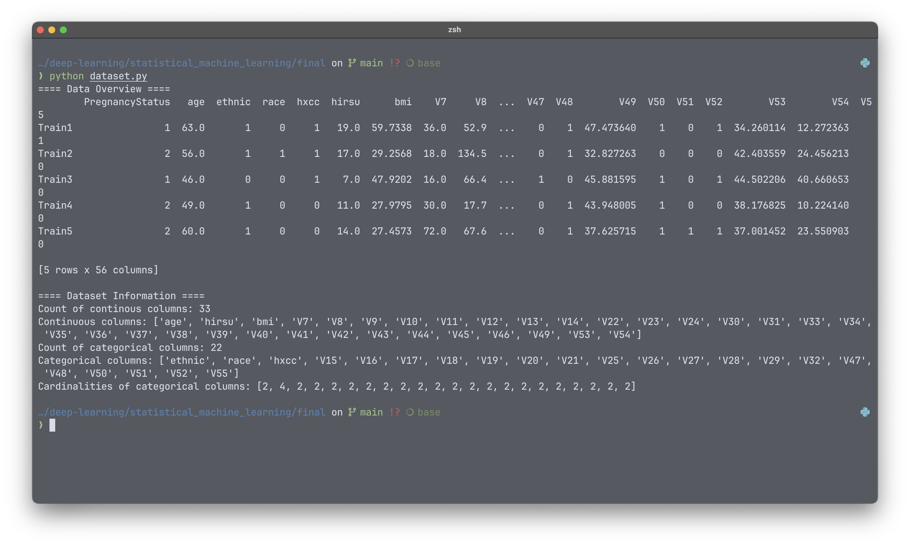
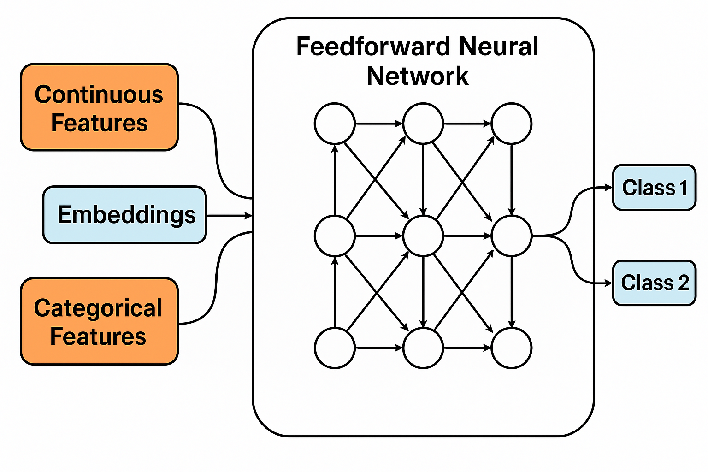
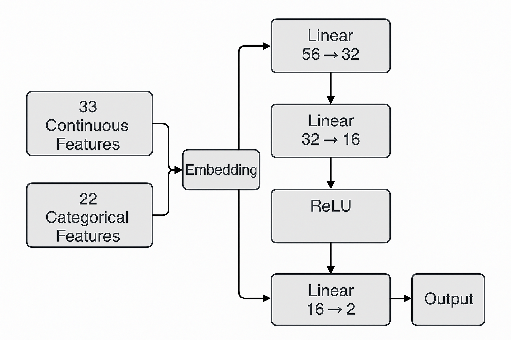
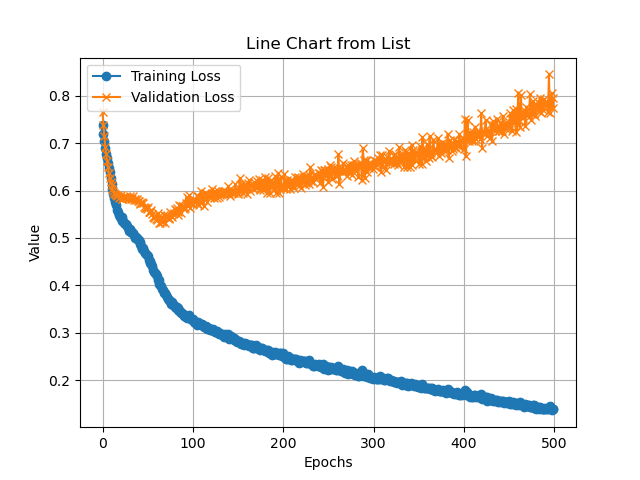

# Final Project for Statistical Machine Learning

> This is a report for the final project of the RUC summer school course -- Statical Machine Learning, the total report contains three parts, with about 613 words, which means about 5 minutes to finish reading. Below is the table of contents.
> - Problem Statement and Data Understanding
> - Method
> - Experiments
>
> All the experiment codes and pretrained model can be downloaded from [Github](https://github.com/YichenShen0103/SML_final).

## 1  Problem Statement and Data Understanding

Reading the instructions of the final project, we can see that what we should do is to solve a binary classify problem with mixed types of attributes. The mixed types mentioned here means that we have both continous and discrete varibles as input.

Particularly, our problem can be view as a **expert system** for assess the likelihood of infertility being cured. Specifically, given several related data, we should output whether the patient is possible to be cured.

We show the basic information and overview of the dataset below. Use `python dataset.py` to see similar result.

 

## 2  Method

### 2.1 Mixed Input Classifier

We use a feedforward neural network as the backbone of our classifier, with several embedding layer to generate high dimensional representation of discrete variables.

We show the framework of the network in the figure below.

To make it more concrete, since that the dataset we use is a quite small dataset, we cannot use complex neural networks to classify the input, which may cause the risk of overfitting the training data. We will show evidence of this statement in our experiment in section 3.

Thus, we use simple MLP with embedding layers as our classifier. We expect the hidden layer to extract the high dimensional distribution of the dataset, and use the final linear layer to generate the prediction.

### 2.2 Implement Details

We use PyTorch to implement our method, the code can be downloaded from GitHub with the link we given in the introduction section. Codes of this part can be found in `network.py`.

Typically, we fit the model to be a MLP with 2 hidden layers, containing 32 and 16 hidden size respectively. In the embedding layer, we train a independent embedding for each given categorical attribute. After that we concat the continous attributes and the embedded categorical attributes into the MLP, which generate a 2 dimensional output, each dimension $i$ represents the probability of this input is going to be classified as $i$-th class.

The overall model has about 2500 learnable parameters. The network detail is shown in the figure below.

## 3  Experiments

### 3.1  Training Process

We use 80% of the training data to train the model, while the remaining 20% as validation data to avoid the model from overfitting. Plus, we leverage the early drop stratergy to achieve better overfitting avoidence.

We use the classic cross entropy loss and a Adam optimizer with initial learning rate equals to 1e-3 to let the loss converges easier. 

### 3.2 Overfitting Experiment

Turning off the early drop stratergy, we can draw a figure of the traing and the validation loss. We can clearly see that it shows strong overfitting after 500 epochs of training.

### 3.3  Performance Experiment

We provide a inference and evaluation script to infer from the testing set and evaluate the performance of our model.

Since the dataset is too small for deep learning, which means the performance will be very random, we train the model for 1200 times, and choose the one with best performance.

|            | Training Loss | Validation Loss | Validation Accuracy | Test Accuracy |
| ---------- | ------------- | --------------- | ------------------- | ------------- |
| Best model |               |                 |                     |               |

---

**Reference**:

1. Aston Zhang, Zachary C. Lipton, Mu Li and Alexander J. Smola. *Dive into deep learning*. 